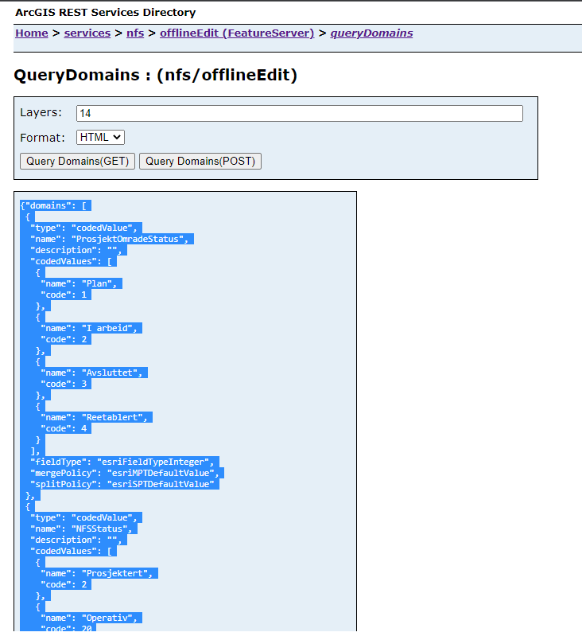
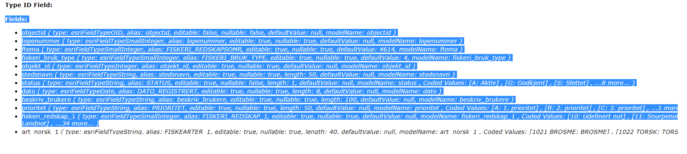
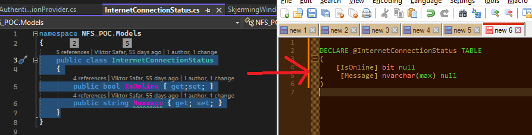
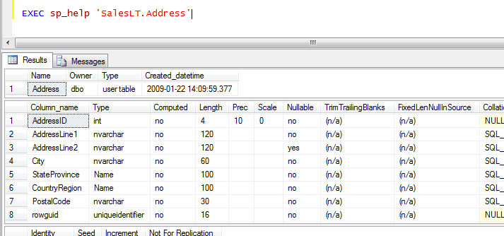
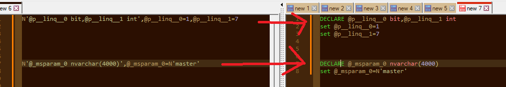
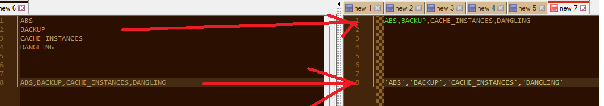

# Clipboard helper

Text transformation tool. Takes your clipboard as input, replaces it with output. 

## How to
* Get the exe file
* Place a shortcut on you desktop
* Go to the shortcut properties
* Set a Shortcut Key
  * eg. I use CTRL+ALT+C which means that I can do a sequence CTRL+C - CTRL+ALT+C - CTRL+V to get Profit!
  * but you can also run this via a click (eg. from the taskbar) :)

## Implemented transformations

Order of these is important as if the tool determines the input is of eg. ArcGIS domains, it will not do anything else but run the ArcGIS domains transformation

- ArcGIS domains (as defined on queryDomains REST service endpoint) to C# enums 

- ArcGIS fields (as defined on a feature service layer) to C# class

- C# class (a model) to SQL DECLARE TABLE 

- Pretty print JSON
  - this works pretty well, unlike the SQL pretty print below

- SQL table info to C# class
  - SQL: sp_help 'TableName'
  - generates this result set; copy the 2nd table with columns to transfor into a C# model
  - includes a SQL INSERT INTO TableName statement

- HTTP link to HTML anchor element

- Stack Trace formatting
  - when your stack trace is logged without formatting and you want to inspect it

- Ugly SQL → semi-pretty SQL
  - it's not very smart, so far adding a new line before some key words and capitalizing most of SQL keywords
  - handy when you have a large query as one-liner
  - could use a SQL parser and do it properly but no time!

- SQL parameters to SQL declaration + value set
  - useful for debugging parametrized SQL queries where all you have is a trace from SQL Profiler

- List → CSV (good for columns of values eg. copied from a SSMS resultset)
- CSV → single quoted CSV 
  - when you need to transfor a column of values from a SSMS result set into a CSV of strings, you run the tool twice

